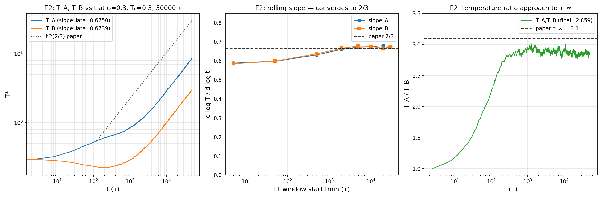
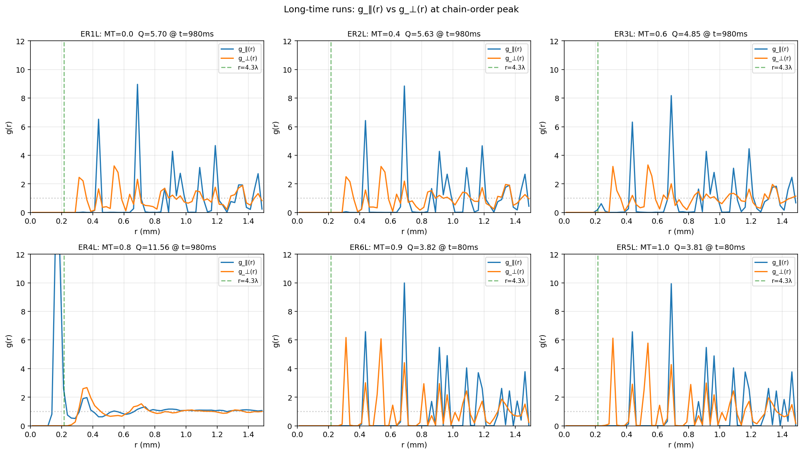
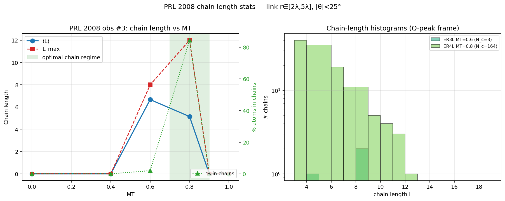

<h1 align="center">Agentic MD-for-Dummies</h1>

<p align="center">
  <strong>A small but complete molecular-dynamics framework for reproducing physics papers — driven by an AI skill that turns a paper into a runnable experiment config.</strong>
</p>

<p align="center">
  <a href="#what-this-is">What this is</a> •
  <a href="#how-it-works">How it works</a> •
  <a href="#quickstart">Quickstart</a> •
  <a href="#the-ai-skill-workflow">AI Skill Workflow</a> •
  <a href="#human-developer-walkthrough">Human Walkthrough</a> •
  <a href="#adding-your-own-paper">Add Your Paper</a> •
  <a href="#references">References</a>
</p>

<p align="center">
  
  
  
  
</p>

<p align="center">
  <strong>English</strong> · <a href="README_zh.md">简体中文</a>
</p>

---

## What this is

Most MD papers come with screenshots, a methods section, and a wave goodbye. **Reproducing them takes weeks.** You read the paper, decode the parameters, build a runner, glue together force fields, write analysis, plot figures, then realize you misread `T₀=0.3` as `T=0.3`.

`agentic-md-for-dummies` is a **paper-driven workflow** built on a minimal Taichi MD core. It is:

> **Not** another high-performance MD engine. There are excellent ones (LAMMPS, GROMACS, GPUMD).
>
> **Yes** a teaching framework that shows the full path: *paper → parameters → simulation → analysis → figure*, and lets you swap papers by writing one config file plus (when needed) one adapter.

It ships with two **end-to-end reproductions** of recent complex-plasma papers as worked examples:

- Ivlev et al., *Phys. Rev. X* **5**, 011035 (2015) — non-reciprocal Hertzian, two-temperature steady state
- Ivlev et al., *Phys. Rev. Lett.* **100**, 095003 (2008) — anisotropic Yukawa, chain formation

### What's inside

| | |
|---|---|
| 🧱 **4-layer architecture** | Config → Adapter → Platform → Infrastructure. Each layer talks only to the one below it. |
| 🤖 **AI skill** | A Claude Code skill (`paper-to-experiment`) that walks a paper into a validated config in 7 steps, with an 8-step extension flow for new force / analyzer / plotter / aggregator and a 9-step flow for a new time integrator. |
| 📋 **Schema-validated configs** | JSON Schema + physics rules + budget guards. Bad configs fail before any GPU is touched. |
| 🔌 **Class-name dispatch** | Add a new analyzer / visualizer / aggregator? One file + one registry line. No central if-else. |
| 🧪 **Layered testing** | Schema gate, manifest gate, registry gate, runtime gate. Every contract has an enforcement point. |
| 📐 **Three reference papers** | PRX 2015 (slope_A=2/3 to within 1%), PRL 2008 (chain phase, ⟨L⟩=5.15 at MT=0.8), and PRL 2018 KA binary LJ (g_AB peak < g_AA peak across 3 temperatures). |

---

## Why "for-Dummies"?

Because reproducing a physics paper shouldn't require:

- ❌ a custom 5000-line C++ runner per paper
- ❌ a 30-step manual lab notebook of "convert φ to N then to box length"
- ❌ guessing whether `dt` is in fs or τ
- ❌ rebuilding the analysis pipeline every time

It should look like:

```bash
# Tell the AI which paper to reproduce
$ /paper-to-experiment Ivlev_PRX_2015.pdf

# Skill walks the design template, asks ASK USER: questions if any,
# then emits a validated config file:
configs/plan_prx_t0sweep.json    ✓ schema valid
                                  ✓ physics rules pass
                                  ✓ within budget (4 hr/run)

# You launch it
$ python scripts/run_experiment.py configs/plan_prx_t0sweep.json
```

That's it. No new force class to write (PRX 2015's force already exists), no analyzer to plumb, no figure code to copy-paste.

---

## How it works

The framework is **strictly four-layered**. Each layer talks only to the one below. Mixing layers is the #1 source of bugs.

```
╔══════════════════════════════════════════════════════════════════════╗
║  Layer 4 — CONFIG     (data, no code)                                 ║   ← USER WRITES
║  configs/plan_*.json — campaign list, phases, class names             ║     this every paper
╠══════════════════════════════════════════════════════════════════════╣
║  Layer 3 — ADAPTER     (per-paper, follows TEMPLATE)                  ║   ← USER WRITES
║  prx_nonreciprocal_run.py, er_plasma_run.py                           ║     this for new papers
╠══════════════════════════════════════════════════════════════════════╣
║  Layer 2 — PLATFORM    (paper-agnostic, frozen unless bug)            ║   ← FRAMEWORK
║  scripts/run_experiment.py — orchestrator                              ║     OWNS this
║  tools/ — analyzers, plotters, aggregators, visualizers, registry      ║
╠══════════════════════════════════════════════════════════════════════╣
║  Layer 1 — INFRASTRUCTURE  (Taichi MD core; math frozen,              ║
║  structural extensions OK via forces/ + integrators/ packages)         ║
║  systemClass, atomSystemClass, searchBox, forces/, integrators/, ...   ║
╚══════════════════════════════════════════════════════════════════════╝
```

A single run goes through six numbered phases:

```
0. validate config   (JSON Schema + physics + budget)        — no GPU touched
1. preflight         (resource estimate per run)             — no GPU touched
2. smoke             (default 100 steps, catches crashes)
3. production        (the real run, parallel-safe)
4. visualize         (optional, registry-dispatched)         — Taichi UI / mp4
5. aggregate         (optional, cross-run figures + report)
```

Full architecture spec: [`docs/ARCHITECTURE.md`](docs/ARCHITECTURE.md).

---

## Quickstart

### Install

```bash
git clone https://github.com/thematteroftime/agentic-md-for-dummies
cd agentic-md-for-dummies
pip install -r requirements.txt
```

> **GPU note**: this project uses Taichi 1.7.4 with CUDA. CPU-only Taichi works for the smoke tests but is slow for production-scale runs. Tested on RTX 5060 Laptop (8 GB VRAM).

### Validate an example config (no compute)

Every config goes through three pre-launch gates before any GPU is touched. Try them:

```bash
# Schema + physics + budget validation. Exits 0 = ready to launch.
python scripts/validate_config.py configs/examples/plan_g_er_chains.json --strict
```

The validator prints a cost estimate (per-run wall + total VRAM). Re-run with `--strict` to fail on warnings.

### Run a small example

The PRL 2008 short ER plasma campaign (5 runs × 50k steps ≈ 20 min on RTX 5060):

```bash
python scripts/run_experiment.py configs/examples/plan_g_er_chains.json
```

Outputs go to `outputFiles/<TS>_<tag>/` per run (HDF5 trajectory + manifest.json + per-run report.md). Cross-run figures land in `docs/images/` once Phase 4 (aggregate) runs.

> **Heavier examples** (multi-hour, e.g. `plan_e_damping.json`, `plan_g2_er_long.json`) are listed in `configs/examples/` for reference. Validate them first; launch only when you've budgeted the wall time.

### Run the test suite

```bash
pytest tests/ -q
```

This exercises the schema, registry, validators, and contract conformance in seconds.

### Standalone utilities

Three CLI helpers under `scripts/` that don't fit in the main pipeline:

| Script | Purpose |
|--------|---------|
| `scripts/bench_neighbor.py` | Benchmark cell-list (`cho=1`) vs O(N²) (`cho=2`) at several N — picks the right `cho` for your hardware. |
| `scripts/compute_delta_eff.py` | Numerically integrate the PRX 2015 `Δ_eff` and `ε` fingerprints from the force kernel — sanity-check before launching a Hertzian non-reciprocal campaign. |
| `scripts/two_particle_calibration.py` | Two-particle controlled-collision test for the Hertzian non-reciprocal force — verifies single-pair energy injection against paper Eq. (5). |
| `scripts/visualize_er_h5.py` | Real-time Taichi-UI animation of any HDF5 trajectory; also wrapped as `TaichiTrajectoryViz` in `tools/visualizers/` for config-driven dispatch. |

---

## Two ways to use this repo

The skill is the headline feature, but the framework underneath it is plain Python and runs perfectly well without any AI in the loop. Pick the path that matches who you are.

### 🤖 If you are an AI agent

Your contract is the skill at `.claude/skills/paper-to-experiment/`. Read `SKILL.md` first; everything else (templates, registry, worked examples) is referenced from it. The shortest valid invocation is a single sentence in a Claude Code conversation:

> *"Reproduce `papers/pedersen_prl2018.pdf` in this framework. Smoke-scale, NVT, three temperatures along the rho=1.2 isochore."*

What happens next is the skill's 7-step config flow, which the skill itself describes. The two extension flows (8-step force, 9-step integrator) only fire when the paper actually requires a class the framework does not yet ship; in that case the skill stops at design-doc §2a or §3 and surfaces the choice for human greenlight before any code lands.

A few prompt patterns that have proven robust across the five autonomous sub-agent rounds that produced this version:

<details>
<summary>Reproduction prompt — paper already covered by an existing force class</summary>

```
Reproduce <paper title and citation> using paper-to-experiment.

Inputs:
  paper PDF: papers/<slug>.pdf
  scope:     <smoke | small production | full>; bound runs at <N>, steps at <M>;
             3 state points on the (T, rho) isochore unless paper indicates more.

Constraints:
  - Use the existing force_type if the paper's potential is already covered;
    otherwise stop at design doc §2a and ask before extending.
  - Default integrator is baoab_drag for NVE / structural runs and
    baoab_langevin for diffusion-sensitive runs (paper observable decides).
  - Do NOT commit. Hand back the design doc + config + first run dir.
```

</details>

<details>
<summary>Extension prompt — paper introduces a new force class or integrator</summary>

```
The paper at papers/<slug>.pdf needs a new <force class | integrator>
that the framework does not currently ship. Walk the
references/force_types.md §<4 | 5b> extension flow end-to-end:

  1. Implement the new class under forces/<name>.py or integrators/<name>.py
  2. Tests in tests/test_<name>_<N>cases.py
  3. Register in tools/registry.py + the matching package's __init__.py
  4. Schema enum + conditional in templates/plan_config.schema.json
  5. Validator branch (per-force-type or per-integrator)
  6. Adapter wiring; analyzer / plotter / aggregator if step 7-8 of force flow

Then re-run the campaign and verify Hard rule #9 holds (manifest + report
+ at least one fig per run dir). Critique to docs/specs/<date>-<topic>-critique.md.
```

</details>

<details>
<summary>Audit prompt — release readiness</summary>

```
Cross-validate that:
  1. tools/registry.py:_REGISTRY entries are mirrored in each package's
     local __init__.py (forces/, integrators/, tools/{analyzers,plotters,aggregators}/)
  2. schema enum values for force_type and integrator both have working adapters
     and are documented in references/force_types.md
  3. SKILL.md hard rules + force_types.md §3 conventions table + worked examples
     are mutually consistent
  4. README and ARCHITECTURE describe the same code that is on main
  5. pytest -q passes (one pre-existing flaky failure in test_units_reconfigure
     is acceptable; everything else must pass)

Report confirmed bugs separately from open questions; ask before fixing
anything ambiguous.
```

</details>

The skill assumes the paper PDF is on disk under `papers/`. Abstract-only reproductions are unsupported by SKILL Hard rule #2 — they have produced bad reproductions in the past — and the skill will stop and surface the gap rather than guess.

### 👤 If you are a human developer

You can drive every part of the framework by hand. The skill is a convenience layer on top of the same Python that you write directly when you choose to. The smallest end-to-end addition without any AI involvement is:

**1. Define a new force class.** One file in `forces/`, subclass `forceField`, declare `requires_full_list` and `PREFLIGHT_FIELDS`, implement `updateOneF_reciprocal` (or `updateOneF_nonreciprocal`):

```python
# forces/my_potential.py
from constSet import *
from forces.base import forceField


@ti.data_oriented
class MyPotential(forceField):
    requires_full_list = True
    PREFLIGHT_FIELDS = ("T0", "rho", "N", "steps")

    def __init__(self, sigma, eps):
        self.sigma = float(sigma)
        self.eps = float(eps)
        self.reciprocal = True

    @ti.func
    def updateOneF_reciprocal(self, i: ti.i32, j: ti.i32):
        rij = self.searchBox.applyMic(self.atomSystem.pos[j] - self.atomSystem.pos[i])
        r = rij.norm()
        if r * r <= self.cutoffSquare:
            # f_mag = -dV/dr; example here is a soft-core 1/r^4 well.
            f_mag = self.eps * self.sigma**4 / r**5
            self.atomSystem.force[i] += -f_mag * (rij / r)
            U_pair = self.eps * self.sigma**4 / (3.0 * r**3)
            self.atomSystem.pe_per_atom[i] += 0.5 * U_pair
```

**2. Register the class** in two places — one local, one global:

```python
# forces/__init__.py — local registry, used by direct imports
from forces.my_potential import MyPotential

FORCE_REGISTRY: dict[str, type] = {
    "lennard_jones":          lennardJones,
    "er_plasma":              ERPotential,
    "hertzian_nonreciprocal": HertzianNonreciprocal,
    "kalj":                   KobAndersenLJ,
    "my_potential":           MyPotential,    # ← new line
}

# tools/registry.py — single forwarding station
_REGISTRY: dict[str, str] = {
    # ... existing entries ...
    "MyPotential": "forces.my_potential:MyPotential",
}
```

The regression test `tests/test_skill_regression.py:test_registry_local_init_sync` will fail loudly the next time `pytest -q` runs if either side drifts.

**3. Write a campaign config** that references the new force_type and validate it before launching anything:

```bash
cat > configs/plan_my_potential.json << 'EOF'
{
  "_comment": "Smoke run for MyPotential — verify the kernel compiles and ships.",
  "_force_type_doc": "references/force_types.md (pending §N for my_potential)",
  "_units_doc": "reduced_lj",
  "campaign": [{
    "force_type": "my_potential",
    "tag": "mp_smoke",
    "T0": 1.0,
    "N": 200,
    "steps": 5000,
    "stride": 50,
    "ndim": 3,
    "units_regime": "reduced_lj"
  }],
  "pipeline": {"preflight": true, "smoke": true, "smoke_steps": 100,
               "production": true, "halt_on_fail": true, "max_parallel": 1}
}
EOF
python scripts/validate_config.py configs/plan_my_potential.json --strict
python scripts/run_experiment.py configs/plan_my_potential.json
```

The validator will reject the config until you have also extended the schema enum, the dispatcher branch in `scripts/run_experiment.py:_invoke_md`, and the `check_force_type_specific` branch in `scripts/validate_config.py` — these are the steps that the AI skill walks through automatically and that you would do by hand here. The full per-step recipe is in `references/force_types.md §4 "Adding a new force type"`; the file numbers and registration points line up exactly with the AI workflow above.

For an integrator extension the path is parallel: subclass `IntegratorBase` in `integrators/`, declare `REQUIRED_KWARGS` and `OPTIONAL_KWARGS`, implement `inteBegin`, register in `INTEGRATOR_REGISTRY` + `_REGISTRY`, extend the schema's `integrator` enum, and (optionally) add a stability rule to `check_integrator_specific`. `integrators/baoab_drag.py` is the simplest reference; `integrators/baoab_langevin.py` shows the Wiener-noise variant including the `(1 − α²)·k_B·T/m` FD prefactor. The full 9-step recipe is in `references/force_types.md §5b`.

Either way — AI or human — the same regression tests gate the same contracts, the same registry holds the same classes, and the same `pytest -q` says yes or no.

---

## The AI Skill Workflow

The unique value of this repo is in `.claude/skills/paper-to-experiment/` — a [Claude Code skill](https://docs.claude.com/en/docs/claude-code/skills) that takes you from a PDF to a runnable config without you typing a single param twice.

### How AI uses the skill

```
1. You drop a paper in the conversation:
   "Reproduce Ivlev PRX 2015 Fig 1 — sweep T₀ at fixed φ=0.3, NVE."

2. Claude invokes paper-to-experiment skill, which:
   a. Reads .claude/skills/paper-to-experiment/SKILL.md (the contract)
   b. Reads references/force_types.md (which force types this repo knows)
   c. Reads references/examples/ (worked examples from existing papers)
   d. Reads the actual paper PDF you provided

3. Claude fills templates/physics_design.md (12 sections):
   §1 observables (with paper Eq. citations)
   §2 force field choice
   §3 simulation params
   §4 sweep dimensions
   §5-§7 phases, pass criteria, costs
   §10b ASK USER: items it can't decide alone

4. You review the design doc. If §10b is empty (auto-mode safe),
   Claude proceeds; otherwise it stops and asks.

5. Claude emits configs/plan_<topic>.json from the design doc.

6. Claude runs `validate_config.py --strict`. If exit ≠ 0, fix and retry.

7. Hands off the launch command. You decide when to spend GPU.
```

The skill enforces:

- **Citations are mandatory.** Every observable cites a paper Eq. or Fig. number.
- **No silent invention.** Missing param → `ASK USER:`, never a guess.
- **Smoke before production.** Always. No skipping.
- **Budget guards.** Single-run wall > 24 hr or VRAM > 8 GB → reject, propose smaller.
- **Reuse before extending.** New force class only when no existing one matches the paper's Eq.

### What if the paper needs a force type that doesn't exist yet?

The skill walks you through the 8-step extension process documented in `force_types.md` §4:

1. Add the force class to `forces/<your_force>.py` (template provided) + register in `forces/__init__.py:FORCE_REGISTRY` and `tools/registry.py:_REGISTRY`
2. Write tests
3. Create an entry script (Layer 3 adapter, template provided)
4. Update `scripts/run_experiment.py:_invoke_md` dispatcher AND `scripts/validate_config.py:check_force_type_specific`
5. Update the schema enum
6. Document in the registry
7. Add an analyzer (`tools/analyzers/<paper>.py`) producing `report.md`
8. Add a plotter (`tools/plotters/<paper>.py`) producing `fig*.png`

Each step has a template file under `.claude/skills/paper-to-experiment/templates/`.

---

## Human-developer walkthrough

This section is the human-side counterpart of `.claude/skills/paper-to-experiment/SKILL.md`, written as a step-by-step guide. It is intentionally detailed: every checkpoint, every file you touch, every command you run is spelled out, and the Kob-Andersen binary LJ reproduction at `configs/plan_pedersen_kalj.json` is the running example. If you have read the AI Skill Workflow above and want to do the same thing yourself, this is the equivalent map.

Three scenarios cover almost every case:

- **Scenario A — paper uses an existing force type and integrator.** Skip to *Reproduction in seven steps*. This is the path for a Lennard-Jones / Hertzian / anisotropic Yukawa / Kob-Andersen LJ paper.
- **Scenario B — paper introduces a new force class.** Walk *8-step force-class extension* first, then return to the seven-step reproduction.
- **Scenario C — paper introduces (or requires) a new time-integration scheme.** Walk *9-step integrator extension* first, then return to the seven-step reproduction.

The framework's hard rules (citations mandatory, smoke before production, no silent invention, validator must be green before launch, registry kept in sync, reproduction not done until `report.md` + `fig*.png` exist) apply identically whether AI or you drive — they're enforced by the schema validator, the registry regression tests, and the pipeline phases, not by the agent.

---

### Reproduction in seven steps

#### Step 1 — Place the paper PDF on disk

The framework's contract is "no PDF, no design": every reproduction starts from a real paper that the design document can cite. Drop the file under `papers/`, using the lowercase `<author>_<journal><year>.pdf` convention so the directory stays grep-friendly:

```bash
cp /path/to/your/paper.pdf papers/pedersen_prl2018.pdf
ls papers/*.pdf
```

If the paper is paywalled and you only have an abstract, **stop**. The skill's Hard rule #2 forbids abstract-only reproductions because they have produced wrong physics in the past. Either obtain the PDF (preprint server, arXiv, ResearchGate, library) or pick a different paper. The four candidate PDFs already in `papers/` (Bernard 2011, Engel 2013, Pedersen 2018, Prestipino 2005) are all open-access if you need a starting point — see `papers/CANDIDATES.md`.

**Verify before continuing:** `ls papers/<your_slug>.pdf` shows the file and reports a non-zero size.

#### Step 2 — Audit the registry, decide reuse vs extend

Two artefacts together describe what the framework already knows:

```bash
# What force_type / integrator / units_regime strings are valid:
sed -n '1,180p' .claude/skills/paper-to-experiment/references/force_types.md

# The single forwarding station — what classes are wired up:
cat tools/registry.py
```

Read the **Conventions table** at the top of `force_types.md` (it lists each registered force_type's `N`-meaning, default IC, ndim, and units_regime in one place). Then read the per-force-type sections (`## 1. hertzian_nonreciprocal`, `## 2. er_plasma`, `## 3. kalj`) and identify whether the paper's potential matches one of them line-by-line — the same Hamiltonian form, the same units, the same ndim.

Three outcomes:

1. **Reuse**: paper's force matches an existing entry exactly → record `force_type=<name>` in your design doc §2 and proceed to Step 3 of this scenario. Most papers in the same physics regime as PRX 2015 / PRL 2008 / PRL 2018 land here.
2. **Extend**: paper's force is genuinely new → switch to *8-step force-class extension* below, then return.
3. **Degenerate reuse** (e.g. picking `ERPotential` and setting `MT=0` to get an isotropic Yukawa): **forbidden** for thesis-quality work. The manifest will lie about which physics ran and downstream analyzers can misinterpret it. If you're tempted to take this shortcut, declare it in design doc §10b as `ASK USER:` first.

Same exercise for the integrator: read the *Integrator selection* table in `force_types.md §4`. If the paper's central observable is diffusion / viscosity / glass dynamics, the default `baoab_drag` will plateau the MSD (no Wiener noise) and you should plan to either pick `baoab_langevin` or extend further. Structural-only or NVE runs are fine on `baoab_drag`.

**Verify**: write down on paper one line per choice: `force_type = <name>`, `integrator = <name>`, `units_regime = <name>`, `ndim = 2 or 3`. If any line says "needs new class", flip to the corresponding extension section now.

#### Step 3 — Write the design document

Copy the template, name the new file by date and topic, and fill it section by section:

```bash
cp .claude/skills/paper-to-experiment/templates/physics_design.md \
   docs/specs/$(date +%Y-%m-%d)-<your_topic>-design.md
```

Replace **every** `<...>` placeholder. Sections that genuinely do not apply get `N/A — <reason>` rather than deletion, so a future reviewer sees you considered them. The §0 Open-questions early checklist is the one you fill **before** the rest — if any line says `no` or counts ≥ 1, stop and resolve before writing the body of the design.

§1 (observables) is the spine of the document. Each row cites a paper Eq. or Fig. number and states a quantitative target with tolerance. Derived observables (not directly in the paper) get a `*` and an explanation in §11. The KA-LJ design at `.claude/skills/paper-to-experiment/references/examples/worked_example_PRL2018_KALJ.md` is a complete worked reference; copy its §1 table shape for your paper.

§2 (force field) cites the registry — paste the entry's required fields verbatim from `force_types.md`. If you're in Scenario B, fill §2a (the 8-step extension status table) and **stop** here for self-greenlight before walking the extension.

§3 (simulation setup) covers `N`, `box`, `dt`, `T0`, `density`, `boundary_conditions`, `thermostat`, `integrator`, `initial_state`, `equilibration_steps`, `write_stride`, `chunk_size`, `cho`, `steps_per_run`, `t_total`. The `initial_state` field defaults to `square_2d` for ndim=2 or `simple_cubic_3d` for ndim=3; override only when the paper specifies otherwise. For long-range repulsive forces (Coulomb / Yukawa / hard-core surrogate), random IC is **forbidden** by the *Long-range repulsive IC caveat* in `force_types.md §4`.

§4 (sweep dimensions) caps total runs at 12 by default. If you genuinely need more, split into Plan A / Plan B and emit two configs. Each sweep value cites a paper passage motivating it.

§6 (pass criteria) translates each §1 observable into a numeric PASS/NEAR/FAIL rule. The KA-LJ design's §6 is a clean reference.

§7 (expected costs) estimates per-run wall, RAM peak, VRAM peak, disk per run, and total campaign cost. Hard ceilings: 24 hr per run, 8 GB VRAM, 50 GB disk.

§10 splits decisions into two sub-lists. §10a Auto-decisions are defaults you adopted from the registry / examples without asking — explain the rationale. §10b Open questions are items only the reader can resolve, prefixed with `ASK USER:`. **§10b empty is the gate to Step 4**; non-empty means you have unresolved questions and you stop.

**Verify**: open the design doc and grep for `<` characters in any non-code line (`grep -n '<' docs/specs/<your_design>.md | grep -v '\`' `) — every literal `<...>` placeholder is unfilled and a bug.

#### Step 4 — Self-review the design

The §0 Open-questions early checklist already gated Step 3; this step gates Step 5. Walk it again with fresh eyes:

- Is the paper PDF on disk where §0 says? (`ls papers/<slug>.pdf`)
- Does every §1 observable cite a paper Eq./Fig. or carry the `*` mark for derived?
- Is §2's `force_type` actually in `tools/registry.py:_REGISTRY` and `forces/__init__.py:FORCE_REGISTRY`?
- Does §3 `initial_state` exist in `tools/lattices/__init__.py:LATTICE_REGISTRY` (one of `square_2d`, `triangular_2d`, `octagonal_2d`, `simple_cubic_3d`, or a paper-mandated extension)?
- Is §4 total-runs ≤ 12, or did you split into Plan A/B?
- Does §7 cost estimate fit under the hard ceilings?
- Is §10b empty or list-form? If items remain, resolve before continuing.

Any "no" sends you back to Step 3 to fix.

#### Step 5 — Emit `configs/plan_<topic>.json`

The campaign config is the data-only translation of the design document. It carries the metadata, the per-run parameters from §4 cross-product, the pipeline phases, and the registry-class names that drive Phase 3.4 ANALYZE / Phase 3.5 VISUALIZE / Phase 4 AGGREGATE.

The minimal required fields (from `templates/plan_config.schema.json`):

```json
{
  "_comment": "<one paragraph synthesising §0 + §1 from the design doc>",
  "_paper_ref": "<from §0 citation>",
  "_paper_pdf": "papers/<slug>.pdf",
  "_design_doc": "docs/specs/YYYY-MM-DD-<topic>-design.md",
  "_force_type_doc": "references/force_types.md §N",
  "_units_doc": "<reduced_lj | macro_dust | reduced_yukawa>",
  "campaign": [
    {
      "force_type": "<name>",
      "tag": "<unique_run_id>",
      "ndim": 3,
      "units_regime": "reduced_lj",
      "integrator": "baoab_drag",
      "<force-required-fields>": "<from force_types.md>",
      "steps": 100000,
      "stride": 200,
      "notes": "<one-line rationale linked to design doc §>"
    }
  ],
  "pipeline": {
    "preflight": true,
    "smoke": true,
    "smoke_steps": 100,
    "production": true,
    "analyze": true,
    "analyzer_class": "<Paper>Analyzer",
    "halt_on_fail": true,
    "max_parallel": 1,
    "visualize": {"enabled": true, "class": "<Paper>Plotter"}
  },
  "aggregation": {
    "enabled": true,
    "class": "<Paper>Aggregator",
    "output": "docs/<paper>_campaign_report.md",
    "plots": ["overview"]
  }
}
```

For a full real example with three state points, the FD-balanced thermostat, and proper aggregator wiring, copy `configs/plan_pedersen_kalj.json` and adapt — that file is the canonical Scenario A + integrator-override example. For a single-temperature smoke launch suitable for a 30-second sanity check, `configs/examples/plan_pedersen_kalj_smoke.json` is the minimal version of the same campaign.

The classes referenced from `pipeline.analyzer_class`, `pipeline.visualize.class`, and `aggregation.class` MUST already exist in `tools/registry.py:_REGISTRY`. If they don't (Scenario B's analyzer / plotter / aggregator), you go back to the 8-step extension and finish those steps before this config validates.

#### Step 6 — Validate with `--strict`

Every config goes through three pre-launch gates before any GPU time is spent:

```bash
python scripts/validate_config.py configs/plan_<your_topic>.json --strict
```

Exit codes:
- `0` — schema, physics rules, and budget all pass. Proceed to Step 7.
- `1` — schema or physics validation failed. Read the `ERR` lines, fix the JSON, re-run.
- `2` — warnings only (non-strict pass; strict fail). Read the `warn` lines and decide: either fix the config, or document the override in `_comment` and re-run without `--strict` if you're conscious about the trade-off.

The validator also prints a cost estimate (per-run wall, total VRAM, disk). Cross-check it against design doc §7. If the two diverge by more than 2×, the validator's step-rate model is stale relative to your hardware — file an issue and trust the more recent of the two.

If validation passes, re-run **without** `--strict` to see the warnings the strict mode would have hidden — they're all things to fix in a follow-up if the campaign succeeds.

#### Step 7 — Launch

The framework has one entry point:

```bash
python scripts/run_experiment.py configs/plan_<your_topic>.json
```

The pipeline runs the phases in order: **preflight → smoke → production → analyze (3.4) → visualize (3.5) → aggregate**. Smoke catches crashes in 100-step bursts; if any smoke fails and `halt_on_fail=true`, the production phase never starts. Each completed production run lands in `outputFiles/<TS>_<tag>/` with `manifest.json` + `<base>_<step>.h5` + `run.in` + `lattice.xyz`. Phase 3.4 then writes `report.md` per dir, Phase 3.5 writes `figN_*.png` per dir, and Phase 4 writes `docs/<paper>_campaign_report.md` + `docs/images/<paper>_*.png` for the cross-run summary.

**Reproduction is not done until you can see the answer.** Each production run dir must contain at least:

```
outputFiles/<TS>_<tag>/
├── manifest.json     ← engine wired up correctly
├── report.md         ← analyzer ran (Phase 3.4)
└── fig*.png          ← plotter ran (Phase 3.5)
```

If a run dir is missing `report.md` or `fig*.png`, the analyzer / plotter wasn't registered correctly — go back to the 8-step extension Step 7 / Step 8 and fix.

You decide when to spend GPU time. The framework never auto-launches production from the design step.

---

### 8-step force-class extension

Use this when Step 2 told you the paper's potential is genuinely not in the existing `forces/` package. The reference walkthrough is the Kob-Andersen extension that landed in commits `0f0593a` → `b6169c4` → `32f15bb`; every file mentioned below has a real instance in main.

#### Step 1 — Implement the force class

Copy the template and save under `forces/`:

```bash
cp .claude/skills/paper-to-experiment/templates/force_class.py.template \
   forces/<your_force>.py
```

Subclass `forceField` from `forces.base`, declare two class-level attributes (`requires_full_list` and `PREFLIGHT_FIELDS`), and implement either `updateOneF_reciprocal` or `updateOneF_nonreciprocal`. The KA-LJ reference at `forces/kalj.py` is the cleanest extension reference because it covers the per-pair (σ, ε) selection a binary mixture requires; `forces/lennard_jones.py` is the simplest single-species reference.

The pattern looks like:

```python
# forces/<your_force>.py
from constSet import *
from forces.base import forceField


@ti.data_oriented
class <YourForce>(forceField):
    requires_full_list = True              # full neighbour list visits both (i,j) and (j,i)
    PREFLIGHT_FIELDS = ("<paper-specific kwargs>",)

    def __init__(self, <paper params>):
        ...
        self.reciprocal = True             # most forces; non-reciprocal sets False

    @ti.func
    def updateOneF_reciprocal(self, i: ti.i32, j: ti.i32):
        rij = self.searchBox.applyMic(self.atomSystem.pos[j] - self.atomSystem.pos[i])
        r = rij.norm()
        if r * r <= self.cutoffSquare:
            f_mag = ...                                    # -dV/dr at r
            self.atomSystem.force[i] += -f_mag * (rij / r)
            U_pair = ...                                    # the full pair potential at r
            self.atomSystem.pe_per_atom[i] += 0.5 * U_pair  # 0.5 because full-list visits each pair twice
```

Register the new class in **two** registries — one local to the package, one global:

```python
# forces/__init__.py — local registry; consulted by direct imports
from forces.<your_force> import <YourForce>

FORCE_REGISTRY: dict[str, type] = {
    # ... existing entries kept verbatim ...
    "<your_force_type>": <YourForce>,
}

__all__ = [..., "<YourForce>", "FORCE_REGISTRY"]
```

```python
# tools/registry.py — single forwarding station; consulted by config dispatch
_REGISTRY: dict[str, str] = {
    # ... existing entries kept verbatim ...
    "<YourForce>": "forces.<your_force>:<YourForce>",
}
```

Both registries are kept in sync by the regression test `tests/test_skill_regression.py:test_registry_local_init_sync`. If only one side is updated, that test will fail loudly the next time `pytest -q` runs.

**Verify**: `python -c "from forces import <YourForce>, FORCE_REGISTRY; print(FORCE_REGISTRY)"` lists your new entry.

#### Step 2 — Write tests

Pair tests check force magnitude against an analytic 2-particle calculation, force symmetry (or antisymmetry for non-reciprocal forces), and cutoff boundary behaviour.

```bash
cp tests/test_kalj_3cases.py tests/test_<your_class>_<N>cases.py
# adapt the analytic targets to your potential
```

Run until green:

```bash
pytest tests/test_<your_class>_*.py -x -v
```

Tests are mandatory before any production run; this is what catches a sign error in `f_mag` or a missing `0.5 *` in the PE accumulator before it pollutes hours of GPU time.

#### Step 3 — Adapter (per-paper run script)

The adapter is a project-root script that wraps your force class behind the platform's CLI contract. Copy the template:

```bash
cp .claude/skills/paper-to-experiment/templates/adapter_run.py.template <topic>_run.py
```

And adapt by mirroring `pedersen_kalj_run.py`. The structure is:

1. `PARAMS` dict at the top: paper defaults including `force_type`, `integrator`, lattice choice, paper-specific kwargs.
2. `_prepare_lattice(p, suffix)`: build initial positions via `tools.lattices.LATTICE_REGISTRY[p["initial_state"]]` and write the lattice file to `dataFiles/`.
3. `_write_run_in(p, suffix)`: write the `run.in` text file under `dataFiles/` capturing the runtime parameters.
4. `main()`: parse CLI flags, build `systemRun(...)`, call `runWithData()`, write `manifest.json` to the run dir.

The adapter MUST NOT call analyzers, plotters, or visualizers in-process — that's `docs/ARCHITECTURE.md §3.1` *FORBIDDEN*. Phase 3.4/3.5/4 of the pipeline dispatch them by name from the registry.

**Verify** with a CLI smoke run, bypassing the pipeline:

```bash
python <topic>_run.py --tag smoke --steps 100 --N 200 --T0 1.0
ls outputFiles/<TS>_smoke/
# expect: manifest.json + .h5 + run.in + lattice.xyz
```

#### Step 4 — Dispatch wiring + validator branch

`scripts/run_experiment.py` needs to know how to launch your adapter:

```python
# scripts/run_experiment.py
MD_SCRIPT_<TOPIC> = _ROOT / "<topic>_run.py"        # add near the existing MD_SCRIPT_* lines

EXP_DEFAULTS_BY_TYPE = {
    # ... existing entries ...
    "<your_force_type>": {                          # add your defaults
        "N": 1000, "stride": 200, "nu": 0.1,
        # ... other defaults ...
    },
}

EXP_REQUIRED_<TYPE> = ("tag", "<paper-required-1>", "<paper-required-2>", "steps")

# In _normalize_config:
if force_type == "<your_force_type>":
    required = EXP_REQUIRED_<TYPE>

# In _invoke_md:
elif force_type == "<your_force_type>":
    cmd = [PYTHON, str(MD_SCRIPT_<TOPIC>),
           "--tag", str(exp["tag"]),
           # ... map exp dict keys to CLI flags ...]
```

`scripts/validate_config.py:check_force_type_specific` needs a parallel branch:

```python
elif ft == "<your_force_type>":
    # paper-specific physics warnings (sub-critical damping, lattice mismatch, ...)
    ...
```

Forgetting the validator branch causes a silent `else: res.err("unknown force_type")` and your config never validates.

**Verify**: a dummy config with `"force_type": "<your_force_type>"` passes `validate_config.py` without complaining about unknown force_type.

#### Step 5 — Schema enum + conditional

`templates/plan_config.schema.json` is the single source of truth for what configs the framework accepts:

```json
{
  "properties": {
    "force_type": {
      "enum": ["hertzian_nonreciprocal", "er_plasma", "kalj", "<your_force_type>"]
    }
  },
  "allOf": [
    {
      "if":   { "properties": { "force_type": { "const": "<your_force_type>" } } },
      "then": {
        "required": ["<paper-required-fields>"],
        "properties": {
          "ndim":         { "const": 3 },
          "units_regime": { "const": "reduced_lj" }
        }
      }
    }
  ]
}
```

If your paper introduces a brand-new units regime (a new yaml file under `units/`), also extend the top-level `units_regime` enum here.

**Verify**: `python scripts/validate_config.py configs/<your_test>.json --strict` returns exit 0.

#### Step 6 — Document in the registry

`references/force_types.md` is the human-readable counterpart of the schema enum. Add a new section (the outer fence below uses four backticks so the nested `json` block inside renders cleanly):

````markdown
## N. `<your_force_type>`  (<Paper Citation>)

- **paper**: <citation>
- **entry script**: `<topic>_run.py`
- **force class**: `forces.<your_force>:<YourForce>`
- **analyzer**: `tools.analyzers.<paper>:<Paper>Analyzer`
- **plotter**: `tools.plotters.<paper>:<Paper>Plotter`
- **aggregator**: `tools.aggregators.<paper>:<Paper>Aggregator`
- **compat**: `ndim=<2|3>`, `units_regime=<reduced_lj|...>`
- **integrator**: <baoab_drag | baoab_langevin | ...>
- **IC**: <initial_state choice + species labelling rules>

### Required fields per experiment
| field | type | range | meaning |
|-------|------|-------|---------|
| ... |

### Optional fields
| field | type | default | meaning |
|-------|------|---------|---------|
| ... |

### Critical pre-flight rules
- ...

### Example
```json
{ ... canonical config block ... }
```
````

Also add a row to the **Conventions table** at the top of `force_types.md` with your N-meaning and default-IC choices.

#### Step 7 — Analyzer

Per-run analysis class that reads the trajectory and writes `report.md` plus optional `*.npz` files for the plotter:

```bash
cp .claude/skills/paper-to-experiment/templates/analyzer.py.template \
   tools/analyzers/<paper>.py
```

Rename the template's `MyAnalyzer` to `<Paper>Analyzer`, implement `full_analysis(run_dir, **params) -> dict`, and have the method write `<run_dir>/report.md` as a side effect. The full contract is documented in `templates/physics_design.md §1.5` and the worked KA-LJ analyzer at `tools/analyzers/pedersen.py` is the cleanest reference.

Register in **two** places again:

```python
# tools/analyzers/__init__.py
from tools.analyzers.<paper> import <Paper>Analyzer
__all__ = [..., "<Paper>Analyzer"]

# tools/registry.py:_REGISTRY
"<Paper>Analyzer": "tools.analyzers.<paper>:<Paper>Analyzer",
```

In your campaign config, set `pipeline.analyze=true` AND `pipeline.analyzer_class="<Paper>Analyzer"` — Phase 3.4 only fires when both are present.

**Verify**: re-run a single production from Step 4's verify and check the run dir now contains `report.md`.

#### Step 8 — Plotter and aggregator

Per-run figures and cross-run report:

```bash
cp .claude/skills/paper-to-experiment/templates/plotter.py.template \
   tools/plotters/<paper>.py
cp .claude/skills/paper-to-experiment/templates/aggregator.py.template \
   tools/aggregators/<paper>.py
```

`<Paper>Plotter.render(run_dir, **params)` writes ≥1 `<run_dir>/figN_*.png` per run dir; `<Paper>Aggregator.aggregate(run_dirs, output, plots, title, **params)` writes the master `docs/<paper>_campaign_report.md` and renders cross-run figures by calling the plotter's optional `fig_<name>` static methods.

Register both in `tools/registry.py:_REGISTRY` AND mirror in `tools/plotters/__init__.py` and `tools/aggregators/__init__.py`.

In your campaign config, set `pipeline.visualize.enabled=true`, `pipeline.visualize.class="<Paper>Plotter"`, `aggregation.enabled=true`, `aggregation.class="<Paper>Aggregator"`.

**Verify (and the final gate of the 8-step extension)**: re-run one full pipeline launch; every production run dir now contains `manifest.json + report.md + fig*.png`, and `docs/<paper>_campaign_report.md` plus the cross-run images exist. This satisfies SKILL Hard rule #9 and the extension is complete. You can now go back to the seven-step reproduction starting from Step 5.

---

### 9-step integrator extension

Use this when the paper's central observable is diffusion / viscosity / glass dynamics or any other transport / fluctuation quantity that a fluctuation-dissipation-balanced thermostat is required to reproduce. The default `baoab_drag` is drag-only Langevin — the noise term is missing, so MSD plateaus and `T_meas` drifts. The `BAOABLangevin` extension that landed in commit `f65f5d3` is the canonical worked example; every file below has a real instance in main.

#### Step 1 — Implement the integrator class

Copy the template and save under `integrators/`:

```bash
cp .claude/skills/paper-to-experiment/templates/integrator.py.template \
   integrators/<your_scheme>.py
```

Subclass `IntegratorBase` from `integrators.base` and declare three class-level attributes:

```python
# integrators/<your_scheme>.py
import math
from constSet import *
import constSet as cs
from integrators.base import IntegratorBase


@ti.data_oriented
class <YourScheme>(IntegratorBase):
    REQUIRED_KWARGS = ("timeStep", "<paper-required>")
    OPTIONAL_KWARGS = ("nu",)
    SCHEME_NAME = "<your_scheme>"

    def __init__(self, timeStep, <paper-required>, nu=0.0):
        self.delta_t = float(timeStep)
        self.delta_tHalf = self.delta_t / 2.0
        # ... cache scheme-specific constants ...

    @ti.kernel
    def step_<...>_<...>(self):
        ...

    def inteBegin(self):
        # one full step of your splitting; mind atomSystem.zeroZ at the end if ndim=2
        ...
```

The `BAOABLangevin` reference at `integrators/baoab_langevin.py` is short (~60 lines) and shows the FD-balanced Wiener-noise pattern, including the `(1 − α²)·k_B·T_target/m` prefactor and the `ti.randn()` recipe inside the `@ti.kernel`. Copy its skeleton when extending into another stochastic scheme.

#### Step 2 — Tests

The minimum test set:

- **NVE invariance at ν=0**: with the noise term off, the scheme reduces to Velocity Verlet and energy drift over a long run is bounded.
- **Thermostat target hit**: from a non-equilibrium IC, `T_meas` converges to `T_target` within a tolerance (default 5 %; a small margin is acceptable when the test does not pin the Taichi RNG seed).
- **Wiener-noise reproducibility**: under fixed `cs.reconfigure(random_seed=S)`, two runs produce identical trajectories.

`tests/test_baoab_langevin_3cases.py` is the canonical reference.

#### Step 3 — Local registry

```python
# integrators/__init__.py
from integrators.<your_scheme> import <YourScheme>

INTEGRATOR_REGISTRY: dict[str, type] = {
    "baoab_drag":     BAOABDrag,
    "baoab_langevin": BAOABLangevin,
    "<your_scheme>":  <YourScheme>,
}

__all__ = [..., "<YourScheme>"]
```

#### Step 4 — Forwarding station

```python
# tools/registry.py:_REGISTRY
"<YourScheme>": "integrators.<your_scheme>:<YourScheme>",
```

#### Step 5 — Schema enum + conditional

```json
{
  "properties": {
    "integrator": {
      "enum": ["baoab_drag", "baoab_langevin", "<your_scheme>"]
    }
  },
  "allOf": [
    {
      "if":   { "properties": { "integrator": { "const": "<your_scheme>" } }, "required": ["integrator"] },
      "then": { "required": ["<scheme-required-fields>"] }
    }
  ]
}
```

The `"required": ["integrator"]` clause inside the `if` is mandatory — without it the conditional matches every campaign entry that simply omits `integrator` and silently constrains entries the author never intended.

#### Step 6 — Validator stability rule

`scripts/validate_config.py:check_integrator_specific` is the dedicated hook called from `main()` alongside `check_force_type_specific`:

```python
def check_integrator_specific(cfg, res: Result):
    for exp in cfg.get("campaign", []):
        scheme = exp.get("integrator", "baoab_drag")
        tag = exp.get("tag", "<no-tag>")

        if scheme == "<your_scheme>":
            # paper-specific stability rules, e.g. dt × nu < 0.1
            ...
```

This is how `dt × ν < 0.1` is enforced for `baoab_langevin` today. Add a new branch for your scheme.

#### Step 7 — Adapter wiring

Each adapter that wants to use the new integrator dispatches by name:

```python
# in your <topic>_run.py main()
integrator_name = p.get("integrator", DEFAULT_INTEGRATOR)
integrator_cls = INTEGRATOR_REGISTRY[integrator_name]
inte_kwargs = {"timeStep": p["dt"], "nu": p["nu"]}
if "<paper-required>" in integrator_cls.REQUIRED_KWARGS:
    inte_kwargs["<paper-required>"] = p["<paper-required>"]

system = systemRun(..., integrator=integrator_cls, ..., inteParams=inte_kwargs)
```

`pedersen_kalj_run.py` lines 175–195 are the cleanest reference for this dispatch pattern.

#### Step 8 — Registry doc table row

Add a row to the *Integrator selection* table in `references/force_types.md §4`:

| `integrator` | Scheme | Use when | Caveats |
|--------------|--------|----------|---------|
| `<your_scheme>` | <one-line description> | <observable that requires it> | <stability / scope notes> |

If your scheme requires extra config fields beyond `nu` and `T_target`, also add a per-force-type example block under §3 / §5b that shows the canonical config form.

#### Step 9 — Regression test for sync

The `test_integrator_schema_enum_synced_with_registry` test in `tests/test_skill_regression.py` already asserts that every `INTEGRATOR_REGISTRY` key appears in the schema's `integrator` enum and vice versa. Adding your scheme to both registries (Step 3 + Step 4) and to the schema (Step 5) means the test passes automatically. If you add a scheme but skip the schema enum, this test fails the next `pytest -q`. Consider also adding a sibling test that asserts your new integrator is present in `tools/registry.py:_REGISTRY`, mirroring `test_registry_local_init_sync`.

**Verify (and the final gate of the 9-step extension)**: `pytest -q` reports the same baseline pass count plus your new tests, and a campaign config using `"integrator": "<your_scheme>"` validates with `--strict` exit 0.

You can now return to the seven-step reproduction starting from Step 3 (or Step 5 if the design doc was already written).

---

## Adding your own paper

The fastest case is when the paper reuses a force type that the framework already ships. Pick a starter that is closest to your physics — `configs/examples/plan_g_er_chains.json` for an anisotropic-Yukawa-flavoured paper, or `configs/examples/plan_pedersen_kalj_smoke.json` for a binary-mixture or diffusion-sensitive paper that needs the FD-balanced thermostat — then iterate locally:

```
1.  cp configs/examples/plan_pedersen_kalj_smoke.json configs/plan_<your_topic>.json
2.  Edit campaign[0] params per the paper. Cite Eq./Fig. in `notes`.
3.  python scripts/validate_config.py configs/plan_<your_topic>.json --strict
4.  python scripts/run_experiment.py  configs/plan_<your_topic>.json
```

The bigger case applies when the paper introduces a new force, a new integration scheme, a paper-specific analyzer, or a paper-specific plotter / aggregator. The skill ships templates for each extension point, and `references/force_types.md §4` (force class) plus `§5b` (integrator) document the corresponding 8-step and 9-step extension flows. Drop each template into the correct package, then add one row each to `tools/registry.py` and to the matching package's local registry — the regression tests will fail loudly if either side drifts.

| Goal | Copy template | Save as |
|------|---------------|---------|
| New force type | `templates/force_class.py.template` | `forces/<your_force>.py` |
| New integrator scheme | `templates/integrator.py.template` | `integrators/<your_scheme>.py` |
| New paper adapter | `templates/adapter_run.py.template` | `<topic>_run.py` |
| New analyzer | `templates/analyzer.py.template` | `tools/analyzers/<topic>.py` |
| New plotter | `templates/plotter.py.template` | `tools/plotters/<topic>.py` |
| New aggregator | `templates/aggregator.py.template` | `tools/aggregators/<topic>.py` |
| New visualizer | `templates/visualizer.py.template` | `tools/visualizers/<topic>.py` |

---

## Reference reproductions

Three papers are reproduced end-to-end and shipped as worked examples in this repository. Each is a complete walk through the skill: a JSON config under `configs/`, a per-paper analyzer / plotter / aggregator under `tools/`, and either reproduction figures committed to `docs/images/` (PRX 2015, PRL 2008) or a cross-run report rendered into `docs/` on demand (PRL 2018). The first two cover the original physics-engine validation; the third was added during the `v0.2.0` cycle to exercise the binary-mixture force extension and the FD-balanced Langevin integrator extension on the same paper.

### Ivlev et al., *Phys. Rev. X* 5, 011035 (2015)

**Non-reciprocal Hertzian binary mixture, two-temperature NVE asymptote.**

| Observable | Paper | Reproduced | Error |
|------------|-------|------------|-------|
| slope_A (T_A ∝ t^α) | 2/3 ≈ 0.667 | 0.6617 | 0.74% |
| τ_∞ = T_A/T_B | 3.10 | 2.86 | 7.9% |
| Δ_eff (analytical fingerprint) | 0.57 | 0.5714 | 0.25% |
| ε (analytical fingerprint) | 0.082 | 0.0822 | 0.19% |

<p align="center">
  
  <br><em>Figure 5 — Best-case showcase: slope=2/3 + τ asymptote + KE growing.</em>
</p>

<details>
<summary>More PRX figures (click to expand)</summary>

- `docs/images/fig1_multi_T0.png` — multi-T₀ trajectories
- `docs/images/fig2_multi_phi.png` — multi-φ + n^(2/3) collapse
- `docs/images/fig7_E2_engine_diagnostics.png` — momentum drift √t (Newton 3rd violation)
- `docs/images/fig8_damping_phase_diagram.png` — bifurcation across critical damping ν_c
- `docs/images/fig10_damping_ratio_invariance.png` — T_A/T_B independent of ν

</details>

### Ivlev et al., *Phys. Rev. Lett.* 100, 095003 (2008)

**Anisotropic Yukawa potential, chain formation in electrorheological complex plasmas.**

| Observable | Paper | Reproduced |
|------------|-------|------------|
| g_∥/g_⊥ ratio at chain peak (MT=0.8) | > 2× | **5.33×** |
| chain spacing r* | ≈ 4λ | 3.6 λ |
| optimal MT regime | [0.6, 0.9] | [0.7, 0.9] (Q-peak monotonic) |
| ⟨L⟩ at MT=0.8 (paper qualitative) | "chains form" | **5.15 particles, 84% of system** |
| Sonic instability (MT→1) | qualitative | **0 chains @ MT=1.0** |

<p align="center">
  
  <br><em>Figure 15 — g_∥(r) vs g_⊥(r) at peak chain time. ER4L (MT=0.8) shows the textbook chain signature: dominant axial peak at r ≈ 3.6λ, suppressed transverse correlation.</em>
</p>

<p align="center">
  
  <br><em>Figure 17 — Chain length distribution. ⟨L⟩ peaks at MT=0.8; collapses at sonic limit MT=1.</em>
</p>

### Pedersen, Schrøder, Dyre, *Phys. Rev. Lett.* 120, 165501 (2018)

**Kob-Andersen binary Lennard-Jones mixture, structural and dynamic verification.** This reproduction is qualitative by design: the engine has no NPT and no Frenkel-Ladd free-energy integration, so the paper's central coexistence-line claim (T_m = 1.028 at ρ = 1.2) is documented as out of scope and the campaign instead targets the partial radial distribution functions and per-species diffusivity along the (T = {0.7, 1.0, 1.3}, ρ = 1.2) isochore.

| Observable | Paper / analytic target | Reproduced (T = 1.0, ρ = 1.2) |
|------------|--------------------------|-------------------------------|
| g_AA first peak | σ_AA · 2^{1/6} ≈ 1.122 σ_AA | 1.094 σ_AA (2.5% under) |
| g_AB first peak | σ_AB · 2^{1/6} ≈ 0.898 σ_AA | 0.906 σ_AA (0.9% over) |
| g_AB peak < g_AA peak | strict ordering from σ_AB < σ_AA | satisfied at all three temperatures |
| T_meas vs T_target (FD setpoint) | within 5% on the late half of the trajectory | 0.27% at T = 1.3, 0.78% at T = 1.0, 0.80% at T = 0.7 |
| Diffusivity ordering D_B > D_A | implied by σ_BB < σ_AA | D_B / D_A ≈ 1.4 at all three temperatures |

The campaign is the canonical example of the joint **8-step force extension** (`forces/kalj.py:KobAndersenLJ` + analyzer / plotter / aggregator) and **9-step integrator extension** (`integrators/baoab_langevin.py:BAOABLangevin`) flow. The full design walkthrough lives at `.claude/skills/paper-to-experiment/references/examples/worked_example_PRL2018_KALJ.md`. The campaign config that produced the numbers above is `configs/plan_pedersen_kalj.json`; for a sub-minute smoke run, see `configs/examples/plan_pedersen_kalj_smoke.json`.

---

## Project layout

```
agentic-md-for-dummies/
├── README.md / README_zh.md        this file (English / 简体中文)
├── LICENSE                         MIT
├── requirements.txt
│
├── docs/
│   ├── ARCHITECTURE.md             the 4-layer + 6-phase spec (~400 lines)
│   └── images/                     reproduction figures (8 selected)
│
├── .claude/skills/
│   ├── paper-to-experiment/        the AI skill that drives the workflow
│   │   ├── SKILL.md                7-step config flow + 8-step extension + hard rules
│   │   ├── templates/              physics_design.md, plan_config.schema.json
│   │   └── references/             force_types registry + worked examples
│   └── creator/                    meta-skill (generate a paper-to-experiment
│                                    skill for a different framework — WIP)
│
├── configs/examples/               worked example configs (PRX-era, ER, and a KA-LJ smoke)
│
├── tools/                          platform package (registry-dispatched)
│   ├── analyzers/{prx,er,pedersen}.py
│   ├── plotters/{prx,pedersen}.py
│   ├── aggregators/{prx,er,pedersen}.py
│   ├── lattices/{square_2d,triangular_2d,octagonal_2d,simple_cubic_3d}.py
│   ├── visualizers/taichi_traj.py
│   ├── registry.py                 name → class lookup
│   ├── runner.py / resources.py / file_io.py
│   ├── validate_manifest.py        post-run §3.2 contract gate
│   └── migrate_manifests.py        backfill canonical fields in old manifests
│
├── scripts/
│   ├── run_experiment.py           the SOLE entry point
│   ├── validate_config.py          schema + physics + budget gate
│   └── analyze_er.py               ER analysis CLI (chain / long / length)
│
├── prx_nonreciprocal_run.py        Layer 3 adapter — PRX 2015
├── er_plasma_run.py                Layer 3 adapter — PRL 2008
├── pedersen_kalj_run.py            Layer 3 adapter — PRL 2018
│
├── forces/                         Layer 1 — one file per force class (HertzianNonreciprocal, ERPotential, LJ, KobAndersenLJ)
├── integrators/                    Layer 1 — one file per integrator scheme (BAOABDrag, BAOABLangevin)
├── systemClass.py                  Layer 1 — MD orchestrator
├── atomSystemClass.py              Layer 1 — particle state
├── searchBox.py                    Layer 1 — cell-list / O(N²) neighbor table
├── constSet.py                     Layer 1 — units (reduced / macro)
├── toolClass.py                    backward-compat shim for the tools/ split
│
└── tests/                          pytest contract + regression tests
```

---

## Contributing

This is a teaching framework — the goal is **clarity over performance, reproducibility over feature count**. Pull requests welcome, especially:

- new paper reproductions (with worked example config + adapter + analyzer)
- new analyzers / visualizers / aggregators
- documentation / explanatory diagrams in `ARCHITECTURE.md`

Less welcome:

- alternative integrators / accelerators (the Layer 1 core is intentionally frozen)
- giant abstraction layers — the simplicity is a feature

When opening a PR for a new paper:

1. Add a config under `configs/examples/`
2. If the paper needs a new force, follow `force_types.md` §4 (the 8-step extension process)
3. Add tests under `tests/`
4. Add 1-2 reproduction figures to `docs/images/` and reference them in your example config's `_design_doc`

---

## References

- Ivlev, A. V. *et al.* "Statistical mechanics where Newton's third law is broken." *Phys. Rev. X* **5**, 011035 (2015). [DOI:10.1103/PhysRevX.5.011035](https://doi.org/10.1103/PhysRevX.5.011035)
- Ivlev, A. V. *et al.* "First Observation of Electrorheological Plasmas." *Phys. Rev. Lett.* **100**, 095003 (2008). [DOI:10.1103/PhysRevLett.100.095003](https://doi.org/10.1103/PhysRevLett.100.095003)
- Pedersen, U. R., Schrøder, T. B., Dyre, J. C. "Phase Diagram of Kob-Andersen-Type Binary Lennard-Jones Mixtures." *Phys. Rev. Lett.* **120**, 165501 (2018). [DOI:10.1103/PhysRevLett.120.165501](https://doi.org/10.1103/PhysRevLett.120.165501)
- Hu, Y. *et al.* "Taichi: a Language for High-Performance Computation on Spatially Sparse Data Structures." *ACM Trans. Graph.* **38**, 6 (2019). The Taichi compiler powering Layer 1.

---

## License

MIT — see [`LICENSE`](LICENSE).

If you use this framework in published work, citing the framework is appreciated but not required. Citing the original physics papers (above) is required.
